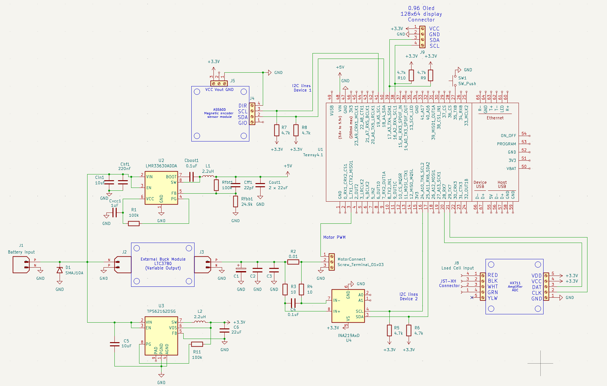

This firmware runs on an onboard Teensy 4.1 MCU in a custom designed PCB for an automated servo motor testing machine. You attach a servo, press a button, and it runs 10 tests automatically \- measuring position accuracy, speed, torque, stall point \- and reports everything on the OLED and over serial. 

### It's split into two phases: 
- Phase 1 (no load, pure motion tests) 
- Phase 2 (with a physical load touching the servo arm, torque/force tests).

Hardware Being Used -
| Device            | What it does in this project                                      |
|------------------|-------------------------------------------------------------------|
| AS5600           | Magnetic encoder \- reads the actual angle of the servo shaft      |
| INA219           | Current + voltage sensor \- measures what the servo is drawing     |
| HX711 + Load Cell| Measures force being applied to the servo arm                     |
| SSD1306 OLED     | 128x64 display \- shows live test status                           |
| SW1 Button       | User input \- advances between test phases                         |
| Servo PWM        | The servo motor being tested                                      |

The Custom Designed Schematic is as such - 


Here is a detailed explainantion of what is happening in each test and what will be displayed in the OLED screen as well as the serial monitor.

## Phase 1: No Load Tests

### Step 1 — Sweep Test
Moves servo 0°→180°→0° in 2° steps. Records angle, current, and timestamp at every step. Shows if the servo tracks commands accurately while moving and if current spikes at any specific angle.

**OLED Display:**
```
┌─────────────────────────┐
│       SWEEP TEST        │
│ Target:  90.0 deg       │
│ Actual:  89.7 deg       │
│ Current: 210.0 mA       │
│  │
└─────────────────────────┘
```

**Serial Output:**
```
══════════════════════════════════════════════
STEP 1: SWEEP TEST - Angle vs Time vs Current
══════════════════════════════════════════════
  t(ms)  | Target(°) | Actual(°) | Current(mA)
  -------|-----------|-----------|------------
       0 |      0.00 |      0.35 |      142.00
      22 |      2.00 |      2.11 |      198.00
      44 |      4.00 |      3.89 |      210.00
     ...
    1820 |    180.00 |    179.45 |      188.00
```

---

### Step 2 - Position Accuracy
Commands 5 angles (0°, 45°, 90°, 135°, 180°), waits for full settle, then reads actual angle. Computes `error = target - actual` for each. Reveals systematic bias or endpoint inaccuracy.

**OLED Display:**
```
┌─────────────────────────┐
│     POSITION TEST       │
│ Target:   90.0 deg      │
│ Actual:   89.9 deg      │
│ Error:   +0.10 deg      │
└─────────────────────────┘
```

**Serial Output:**
```
══════════════════════════════════════════════
STEP 2: POSITION ACCURACY
══════════════════════════════════════════════
  Target(°) | Actual(°) | Error(°)
  ----------|-----------|----------
       0.00 |      0.35 |   -0.350
      45.00 |     44.82 |   +0.180
      90.00 |     89.91 |   +0.090
     135.00 |    134.76 |   +0.240
     180.00 |    179.44 |   +0.560
  Max absolute error: 0.560°
```

---

### Step 3 - Repeatability
Moves to 90° seven times from 0° each time. Computes mean and standard deviation of the 7 readings. Low stdDev = tight mechanical consistency. High stdDev = backlash or gear play.

**OLED Display:**
```
┌─────────────────────────┐
│     Repeatability       │
│ Run 4: 89.921 deg       │
│ Target: 90 deg          │
└─────────────────────────┘
```

**Serial Output:**
```
══════════════════════════════════════════════
STEP 3: REPEATABILITY (target 90°)
══════════════════════════════════════════════
  Run 1: 89.912°    Run 5: 89.945°
  Run 2: 89.934°    Run 6: 89.908°
  Run 3: 89.898°    Run 7: 89.917°
  Run 4: 89.921°
  Mean:   89.919°
  StdDev: 0.0156°
  Range:  0.0470°
```

---

### Step 4 - Speed & Response
Commands 0°→90° and samples at high speed. Records rise time (how long to reach 90°), overshoot (how far past 90° it went), settling time (when it stops oscillating), and peak current.

**OLED Display:**
```
┌─────────────────────────┐
│       Speed Test        │
│ Ang:91.2  I:540mA       │
│ 0 -> 90 deg             │
└─────────────────────────┘
```

**Serial Output:**
```
══════════════════════════════════════════════
STEP 4: SPEED & RESPONSE (0° → 90°)
══════════════════════════════════════════════
  Rise time (to 90°):  210 ms
  Overshoot:           2.34°
  Settling time:       380 ms
  Peak current:        684.0 mA
```

---

## Phase 2: Load Tests

### Step 6 - Contact Detection
Moves forward slowly in 2° steps until load cell force exceeds threshold. Records the contact angle as the reference point for all torque tests.

**OLED Display:**
```
┌─────────────────────────┐
│     Contact Detect      │
│ Ang:22.0 F:4.2g         │
│ I: 145 mA               │
│ Moving forward...       │
└─────────────────────────┘
```

**Serial Output:**
```
══════════════════════════════════════════════
STEP 6: CONTACT DETECTION
══════════════════════════════════════════════
  Contact angle:  24.00°
  Contact force:  23.4 g
```

---

### Step 7 & 8 - Torque Map
From contact angle, pushes further in steps. At each step records force, angle, current, and voltage. Computes torque (`F × arm length`) and power (`V × I`). Reports peak torque angle with efficiency (`N·mm/mW`).

**OLED Display:**
```
┌─────────────────────────┐
│      TORQUE TEST        │
│ Ang: 36.0  I: 398mA     │
│ Force:   112.5 g        │
│ Torque:  55.18 N.mm     │
└─────────────────────────┘
```

**Serial Output:**
```
══════════════════════════════════════════════
STEP 7 & 8: TORQUE vs ANGLE vs CURRENT
══════════════════════════════════════════════
  Angle(°) | Force(g) | Torque(N·mm) | Current(mA) | Voltage(V) | Power(mW)
  ---------|----------|--------------|-------------|------------|----------
     24.00 |    23.40 |       11.481 |      198.00 |      4.980 |    986.04
     28.00 |    45.80 |       22.467 |      245.00 |      4.975 |   1218.88
     36.00 |   112.50 |       55.181 |      398.00 |      4.955 |   1972.09
     48.00 |   183.20 |       89.865 |      558.00 |      4.920 |   2745.36

  --- Peak Torque Point ---
  Angle:      48.00 deg
  Torque:     89.865 N·mm
  Current:    558.0 mA
  Voltage:    4.920 V
  Power:      2745.36 mW
  Efficiency: 0.0327 N·mm/mW
```

---

### Step 9 - Stall Test
Continues increasing load until both conditions trigger simultaneously: angle stops changing AND current spikes above threshold. Records stall torque, stall current, and stall angle.

**OLED Display:**
```
┌─────────────────────────┐
│       STALL TEST        │
│ Angle:   62.0 deg       │
│ Current:1342.0 mA       │
│ Torque: 118.45 N.mm     │
└─────────────────────────┘
```

**Serial Output:**
```
══════════════════════════════════════════════
STEP 9: STALL TEST
══════════════════════════════════════════════
  Stall angle:   62.00°
  Stall torque:  118.450 N·mm
  Stall current: 1342.0 mA
```

---

### Step 10 - Loaded Hold
Holds 90° for 3 seconds under load. Records position drift and current min/max/avg. Low drift + stable current = good servo. High drift or large current swings = weak holding or internal oscillation.

**OLED Display:**
```
┌─────────────────────────┐
│      TORQUE TEST        │
│ Ang: 89.9  I: 312mA     │
│ Force:    98.2 g        │
│ Torque:   48.16 N.mm    │
└─────────────────────────┘
```

**Serial Output:**
```
══════════════════════════════════════════════
STEP 10: LOADED HOLDING TEST
══════════════════════════════════════════════
  Hold angle:    90.00°
  End angle:     89.87°
  Drift:        -0.1300°
  Avg current:   312.4 mA
  Min current:   287.0 mA
  Max current:   341.0 mA
```
